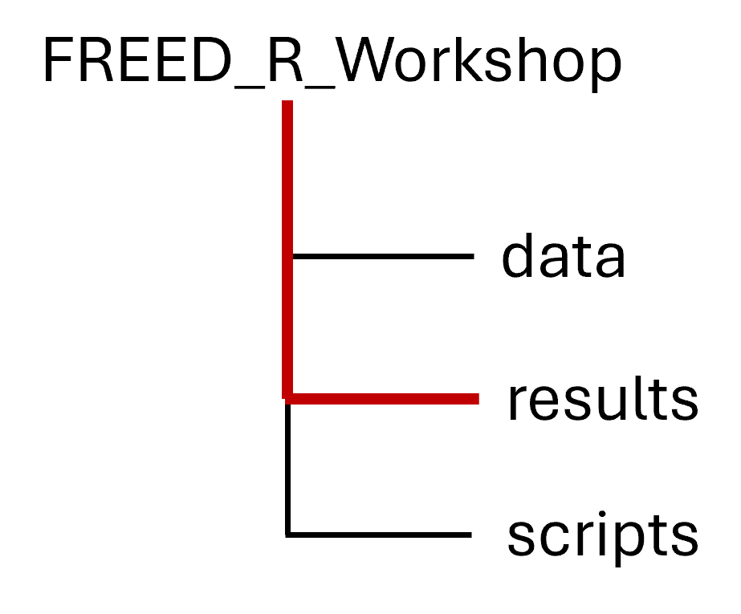

::::::::::::::::::::::::::::::::::::::: objectives

#### Objectives

- Describe the purpose and use of each pane in RStudio 
- Locate buttons and options in RStudio 
- Define a variable
- Assign data to a variable
- Manage a workspace in an interactive R session
- Use mathematical and comparison operators
- Manage packages
::::::::::::::::::::::::::::::::::::::::::::::::::

:::::::::::::::::::::::::::::::::::::::: questions
#### Questions

- How to find your way around RStudio?
- How to interact with R?
- How to manage your environment?
- How to install packages?

::::::::::::::::::::::::::::::::::::::::::::::::::

## R and R Studio Layout
Prior to the workshop, you should have downloaded the latest version of R and R Studio. If you faced any installation issues, please let one of us know so we can resolve them before we begin. 

- [Download and install the latest version of R here](https://www.r-project.org/)
- [Download and install RStudio here](https://www.rstudio.com/products/rstudio/download/#download)


When you first open RStudio, you will be greeted by three panels:

- The interactive R console/Terminal (entire left)
- Environment/History/Connections (tabbed in upper right)
- Files/Plots/Packages/Help/Viewer (tabbed in lower right)

{alt='RStudio layout'}

Once you open files, such as R scripts, an editor panel will also open
in the top left.

{alt='RStudio layout with .R file open'}


### Workflow within RStudio

There are two main ways one can work within RStudio:

1. Test and play within the interactive R console then copy code into
  a .R file to run later.
  - This works well when doing small tests and initially starting off.
  - It quickly becomes laborious
2. Start writing in a .R file and use RStudio's short cut keys for the Run command
  to push the current line, selected lines or modified lines to the
  interactive R console.
  - This is a great way to start; all your code is saved for later
  - You will be able to run the file you create from within RStudio.


#### R scripts

Any commands that you write in the R console can be saved to a file
to be run again.  Files containing R code to be ran in this way are
called R scripts.  R scripts have `.R` at the end of their names to
let you know what they are.

#### R Console

Much of your time in R will be spent in the R interactive
console. This is where you will run all of your code, and can be a
useful environment to try out ideas before adding them to an R script
file. 
The first thing you will see in the R interactive session is a bunch
of information, followed by a ">" and a blinking cursor. You type in commands, R tries to execute them, and then
returns a result.

Let's go through some basic functions that we can perform in R. 

## Basic R Commands
### Using R as a Calculator

The simplest thing you could do with R is to do arithmetic:

```{r}
1 + 100
```

And R will print out the answer, with a preceding "[1]". [1] is the index of
the first element of the line being printed in the console. 

If you type in an incomplete command, R will wait for you to
complete it. If you are familiar with Unix Shell's bash, you may recognize this behavior from bash.

```r
> 1 +
```

```output
+
```

Any time you hit return and the R session shows a "+" instead of a ">", it
means it's waiting for you to complete the command. If you want to cancel
a command you can hit <kbd>Esc</kbd> and RStudio will give you back the ">" prompt.


When using R as a calculator, the order of operations is the same as you
would have learned back in school.

From highest to lowest precedence:

- Parentheses: `(`, `)`
- Exponents: `^` or `**`
- Multiply: `*`
- Divide: `/`
- Add: `+`
- Subtract: `-`

```{r}
3 + 5 * 2
```

Use parentheses to group operations in order to force the order of
evaluation if it differs from the default, or to make clear what you
intend.This can get unwieldy when not needed, but clarifies your intentions.


```{r}
(3 + 5) * 2
```

Really small or large numbers get a scientific notation:

```{r}
2/10000
```

Which is shorthand for "multiplied by `10^XX`". So `2e-4`
is shorthand for `2 * 10^(-4)`.

You can write numbers in scientific notation too:

```{r}
5e3  
```


:::::::::::::::::::::::::::::::::::::::::  challenge

#### Challenge: Perform Calculations in an R Script
As mentioned above, it can be useful to save code in an R script (.R file) to revisit later. Try opening a new R document and writing a command that adds 45 to  621, then subtracts 54. Run the code from the script (see Tip below) and let us know when you have the answer! 
:::::::::::::::::::::::::::::::::::::::::

:::::::::::::::::::::::::::::::::::::::::  tip

#### Tip: Running segments of your code in an R script
 
RStudio offers you great flexibility in running code from within the editor
window. There are buttons, menu choices, and keyboard shortcuts. To run the
current line, you can

1. click on the `Run` button above the editor panel, or
2. select "Run Lines" from the "Code" menu, or
3. hit <kbd>Ctrl</kbd>\+<kbd>Return</kbd> in Windows or Linux
  or <kbd>⌘</kbd>\+<kbd>Return</kbd> on OS X.
  (This shortcut can also be seen by hovering
  the mouse over the button). To run a block of code, select it and then `Run`.
  If you have modified a line of code within a block of code you have just run,
  there is no need to reselect the section and `Run`, you can use the next button
  along, `Re-run the previous region`. This will run the previous code block
  including the modifications you have made.
  
:::::::::::::::::::::::::::::::::::::::::


<input type="checkbox" id="solution-toggle-1" style="display:none;" />
<label for="solution-toggle-1" class="toggle-label">Click to show the solution</label>
<div id="solution-content-1" class="solution">
<h4>Solution:</h4>

1. Create a new file 
File > New file > R script 

2. Type out the code 
```{r, eval=F}
(45 + 621) - 54
```

3. Highlight the code you want to run and press Return/Enter
```{r, echo=F }
(45 + 621) - 54
```
</div>

R has many built in mathematical functions. To call a function,
we can type its name, followed by open and closing parentheses.
Functions take arguments as inputs, anything we type inside the parentheses of a function is considered an argument. 

trigonometry function
```{r}
sin(1)  
```
base 10 logarithm
```{r}
log10(10)  
```

Natural logarithm
```{r}
log(1)  
```

e^(1/2)
```{r}
exp(0.5) 
```

:::::::::::::::::::::::::::::::::::::::::  tip
#### Tipe Annotate your code

Your code may be referenced in the future by others or even yourself. To make it easier to understand, it can be useful to annotate/ leave comments explaining what you are doing. 
This can be done in your R script using #
The text after each line of code is called a "comment". Anything that follows after the hash (or octothorpe) symbol
`#` is ignored by R when it executes code.

Copy the code below and see for yourself! 

```{r, eval=FALSE}
54 ^ 12 #raise 54 to the power of 12 
# 44 * 12
```
:::::::::::::::::::::::::::::::::::::::::  
### Comparing things

We can also do comparisons in R:

```{r}
1 == 1  # equality (note two equals signs, read as "is equal to")
```

```{r}
1 != 2  # inequality (read as "is not equal to")
```

```{r}
1 < 2  # less than
```

```{r}
1 <= 1  # less than or equal to
```

```{r}
1 > 0  # greater than
```

```{r}
1 >= -9 # greater than or equal to
```

:::::::::::::::::::::::::::::::::::::::::  tip

#### Tip: Comparing Numbers

A word of warning about comparing numbers: you should
never use `==` to compare two numbers unless they are
integers (a data type which can specifically represent
only whole numbers).

Computers may only represent decimal numbers with a
certain degree of precision, so two numbers which look
the same when printed out by R, may actually have
different underlying representations and therefore be
different by a small margin of error (called Machine
numeric tolerance).

:::::::::::::::::::::::::::::::::::::::::


### Variables and assignment

We can store values in variables using the assignment operator `<-`, like this:

```{r}
x <- 1/40
```

Notice that assignment does not print a value. Instead, we stored it for later
in something called a **variable**. `x` now contains the **value** `0.025`:

```{r}
x
```

Look for the `Environment` tab in the top right panel of RStudio, and you will see that `x` and its value
have appeared. Our variable `x` can be used in place of a number in any calculation that expects a number:

```{r}
log(x)
```

Notice also that variables can be reassigned:

```{r}
x <- 100
```

`x` used to contain the value 0.025 and now it has the value 100.

Assignment values can contain the variable being assigned to:

```{r}
x <- x + 1 #notice how RStudio updates its description of x on the top right tab
y <- x * 2
```

The right hand side of the assignment can be any valid R expression.
The right hand side is *fully evaluated* before the assignment occurs, meaning that it happens before it is stored in the variable, like we saw above. 

Variable names can contain letters, numbers, underscores and periods but **no spaces**. They
must start with a letter (they cannot start with a number nor an underscore).
Different people use different conventions for long variable names, these include

- periods.between.words
- underscores\_between\_words
- camelCaseToSeparateWords

What you use is up to you, but **be consistent**.

:::::::::::::::::::::::::::::::::::::::  challenge

#### Challenge: Which of the following are valid R variable names?

```{r, eval=FALSE}
min_height
max.height
_age
MaxLength
min-length
2widths
celsius2kelvin
```
::::::::::::::::::::::::::::::::::::::::::::::::::

<input type="checkbox" id="solution-toggle-2" style="display:none;" />
<label for="solution-toggle-2" class="toggle-label">Click to show the solution</label>
<div id="solution-content-2" class="solution">
<h4>Solution:</h4>

The following can be used as R variables:

```{r ch1pt1-sol, eval=FALSE}
min_height
max.height
MaxLength
celsius2kelvin
```

The following will not be able to be used to create a variable

```{r ch1pt3-sol, eval=FALSE}
_age
min-length
2widths
```

</div>

One final thing to be aware of is that R is *vectorized*, meaning that
variables and functions can have vectors as values. In contrast to physics and
mathematics, a vector in R describes a set of values in a certain order of the
same data type. For example:

```{r}
1:5
2^(1:5)
x <- 1:5
2^x
```

This is incredibly powerful; Jason will discuss this further in an
upcoming lesson.

## Managing your R Project

The scientific process is naturally incremental, and many projects
start life as random notes, some code, then a manuscript, and
eventually everything is a bit mixed together.


Some people organize their projects like this:

{alt='Screenshot of file manager demonstrating bad project organisation'}

There are many reasons why we should avoid this:

1. It is really hard to tell which version of your data is
  the original and which is the modified;
2. It gets really messy because it mixes files with various
  extensions together;
3. It probably takes you a lot of time to actually find
  things, and relate the correct figures to the exact code
  that has been used to generate it;

A good project layout will ultimately make your life easier and make science more reproducible:

- It will help ensure the integrity of your data;
- It makes it simpler to share your code with someone else
  (a lab-mate, collaborator, or supervisor);
- It allows you to easily upload your code with your manuscript submission;
- It makes it easier to pick the project back up after a break.

Fortunately, there are tools and packages which can help you manage your work effectively.

One of the most powerful and useful aspects of RStudio is its project management
functionality. We'll be using this today to create a self-contained, reproducible
project.

### Creating a self-contained project

We're going to create a new project in RStudio:

1. Click the "File" menu button, then "New Project".
2. Click "New Directory".
3. Click "New Project".
4. Type in the name of the directory to store your project. For today, we can use "FREED-coding-workshop-April-2025".
5. Click the "Create Project" button.

::::::::::::::::::::::::::::::::::::::::::: tip
#### Tip: Work from your local hard drive
Save your project on the local system, meaning the hard drive of your computer (e.g., "C" Drive). Saving your projects to a cloud-based server (e.g., OneDrive, Google Drive, iCloud) can make it challenging to navigate across folders later on. 
:::::::::::::::::::::::::::::::::::::::::::

The simplest way to open an RStudio project once it has been created is to click
through your file system to get to the directory where it was saved and double
click on the `.Rproj` file. This will open RStudio and start your R session in the
same directory as the `.Rproj` file. All your data, plots and scripts will now be
relative to the project directory. RStudio projects have the added benefit of
allowing you to open multiple projects at the same time each open to its own
project directory. This allows you to keep multiple projects open without them
interfering with each other.

:::::::::::::::::::::::::::::::::::::::  challenge

#### Challenge: Opening an RStudio project through the file system

1. Exit RStudio.
2. Navigate to the directory where you created a project in the last challenge.
3. Double click on the `.Rproj` file in that directory.

:::::::::::::::::::::::::::::::::::::::  

Each time you create a new RStudio Project, it will create a new directory (folder) for that project. When you open an existing `.Rproj` file, it will open that project and set R's working directory to the folder that file is in.

You can check the current working directory with the `getwd()` command, or by using the menus in RStudio.
In the console, type `getwd()` ("wd" is short for "working directory") and hit Enter.


### Best practices for project organization

Although there is no "best" way to lay out a project, there are some general
principles to adhere to that will make project management easier:

**1. Treat data as read only**

This is probably the most important goal of setting up a project. Data is
typically time consuming and/or expensive to collect. Working with them
interactively (e.g., in Excel) where they can be modified means you are never
sure of where the data came from, or how it has been modified since collection.
It is therefore a good idea to treat your data as "read-only".

In many cases your data will need significant preprocessing
to get into a format R (or any other programming language) will find useful.
This task is sometimes called "data munging". Storing these scripts in a
separate folder, and creating a second "read-only" data folder to hold the
"cleaned" data sets can prevent confusion between the two sets.

**2. Treat generated output as disposable**

Anything generated by your scripts should be treated as disposable: it should
all be able to be regenerated from your scripts.

There are lots of different ways to manage this output. Having an output folder
with different sub-directories for each separate analysis makes it easier later.
Since many analyses are exploratory and don't end up being used in the final
project, and some of the analyses get shared between projects.

**3. Keep the project directory organized and intuitive**

   1. Put each project in its own directory, which is named after the project.
   2. Put raw data and metadata in the `data` directory, and files generated during cleanup and analysis in a `results` directory.
   3. Put scripts in the `scripts` directory.
   4. Put the output files in the output directory (e.g., processed data, figures).
   5. Name all files to reflect their content or function.


Le's go ahead and organize our project directory. 
To list the files in your current directory, use the `list.files()` command in your console. You should only have your .Rproj (R project) file. 

To create a subdirectory for our `data`, we will use the `dir.create()` command.

```{r, eval=FALSE}
dir.create("data")
```

:::::::::::::::::::::::::::::::::::::::  challenge

#### Challenge: Create subdirectories for `scripts` and `results`

:::::::::::::::::::::::::::::::::::::::  


<input type="checkbox" id="solution-toggle-3" style="display:none;" />
<label for="solution-toggle-3" class="toggle-label">Click to show the solution</label>
<div id="solution-content-3" class="solution">

<h4>Solution:</h4>

```{r, eval=F}
dir.create("scripts")
dir.create("results")

```
</div>


Now when you use `list.files()`, you should see the R project, as well as these 3 added directories! 

Your directory now looks like this

{width=40%}

:::::::::::::::::::::::::::::::::::::::  tip

#### Tip: Look at the Files Panel
You can look at the bottom right panel in R Studio to see the list of files and folders in your directory. You can navigate to different folders here without changing your working directory.

:::::::::::::::::::::::::::::::::::::::  

### Directory Navigation 

Moving around the directory requires the use of **file paths**. There are two way you can write file paths: 
1. Absolute path
2. Relative path

The absolute path defines every directory and subdirectory that a file is contained in, while a relative path only defines the directories relative to your working directory. Relative paths are a lot quicker to write and are not dependent on folders that might not exist on everyone's system, making them more reproducible. For that reason, we will use relative file paths today (but see a challenge at the end if you want to test your absolute file path skills).

**Moving down** in a directory, into a subdirectory, via a relative filepath requires that you simply add the name of the subdirectory to the filepath. Names in R need to be surrounded by "". 

For example, the relative file path to `results` would be `results/`. We can use this in conjunction with our `list.files()` command to see the files in the `results` subdirectory. 

{width=25%}

```{r, eval=F}
list.files("results/")
```

:::::::::::::::::::::::::::::::::::::::  challenge
#### Challenge: Download the gapminder data from [this link to a csv file](https://swcarpentry.github.io/r-novice-gapminder/data/gapminder_data.csv).

1. Download the file (right mouse click on the link above -> "Save link as" / "Save file as", or click on the link and after the page loads, press <kbd>Ctrl</kbd>\+<kbd>S</kbd> or choose File -> "Save page as")
2. Make sure it's saved under the name `gapminder_data.csv`
3. Save the file in the `data/` folder within your project. This may require you to move it from your `Downloads` folder. 

Double-check that this file is where it should be using list.files() and relative file path together. 

We will load and inspect these data later.
:::::::::::::::::::::::::::::::::::::::  


<input type="checkbox" id="solution-toggle-4" style="display:none;" />
<label for="solution-toggle-4" class="toggle-label">Click to show the solution</label>
<div id="solution-content-4" class="solution">
<h4>Solution:</h4>

```{r, eval=F}
list.files("data/")
```

</div>

:::::::::::::::::::::::::::::::::::::::::  tip

#### Tip: File does not exist errors

When you're attempting to reference a file in your R code and you're getting errors saying the file doesn't exist, it's a good idea to check your working directory and your file path. These errors can often be fixed by revising the file path or changing the working directory need to either provide an absolute path to the file, or you need to make sure the file is saved in the working directory (or a subfolder of the working directory) and provide a relative path.

:::::::::::::::::::::::::::::::::::::::::  


**Moving up in a directory**  requires us to tell R to go one level up using `../` 
In the example below, `Documents` is the directory one level up from our project directory. Using `../` would then situate you in the `Documents` directory. 

{width=25%}

We can list the files in the directory one level up fom our project directory using the `list.files()` command and our relative file path: 

```{r, eval=F}
list.files("../")
```

:::::::::::::::::::::::::::::::::::::::  challenge

#### Challenge: Choose a directory/folder on your computer using your file system. List the files in that folder using `list.files()` and a relative file path. 

:::::::::::::::::::::::::::::::::::::::  

### R Packages

It is possible to add functions to R by writing a package, or by
obtaining a package written by someone else. As of this writing, there
are over 10,000 packages available on CRAN (the comprehensive R archive
network). R and RStudio have functionality for managing packages:

- You can see what packages are installed by typing
  `installed.packages()`
- You can install packages by typing `install.packages("packagename")`,
  where `packagename` is the package name, in quotes.
- You can update installed packages by typing `update.packages()`
- You can remove a package with `remove.packages("packagename")`
- You can make a package available for use with `library(packagename)`

Packages can also be viewed, loaded, and detached in the Packages tab of the lower right panel in RStudio. Clicking on this tab will display all of the installed packages with a checkbox next to them. If the box next to a package name is checked, the package is loaded and if it is empty, the package is not loaded. Click an empty box to load that package and click a checked box to detach that package.

Packages can be installed and updated from the Package tab with the Install and Update buttons at the top of the tab.


:::::::::::::::::::::::::::::::::::::::  challenge

#### Challenge: Install the following packages: `tidyverse`, `gapminder`.
Note: You may get a flag about needing to install dependencies. If you do, click "yes" or add `, dependencies = TRUE` to your code. 

:::::::::::::::::::::::::::::::::::::::  


<input type="checkbox" id="solution-toggle-5" style="display:none;" />
<label for="solution-toggle-5" class="toggle-label">Click to show the solution</label>
<div id="solution-content-5" class="solution">
<h4>Solution:</h4>

We can use the `install.packages()` command to install the required packages.

```{r, eval=FALSE}
install.packages("tidyverse")
install.packages("gapminder")
```

An alternate solution, to install multiple packages with a single `install.packages()` command is:

```{r, eval=FALSE}
install.packages(c("tidyverse", "gapminder"))
```

</div>


:::::::::::::::::::::::::::::::::::::::  tip

#### Tip: How to find help
Don't worry about trying to remember every function in R. You
can look them up on Google, or if you can remember the
start of the function's name, use the tab completion in RStudio.

This is one advantage that RStudio has over R on its own, it
has auto-completion abilities that allow you to more easily
look up functions, their arguments, and the values that they
take.

Typing a `?` before the name of a command will open the help page
for that command. When using RStudio, this will open the 'Help' pane;
if using R in the terminal, the help page will open in your browser.
The help page will include a detailed description of the command and
how it works. Scrolling to the bottom of the help page will usually
show a collection of code examples which illustrate command usage.
We'll go through an example later.

:::::::::::::::::::::::::::::::::::::::  


:::::::::::::::::::::::::::::::::::::::: keypoints

- Use RStudio to write and run R programs.
- R has the usual arithmetic operators and mathematical functions.
- Use `<-` to assign values to variables.
- Use `list.files()` to list the variables in a program.
- Use `../` to move up a file path
- Use `install.packages()` to install packages (libraries).

:::::::::::::::::::::::::::::::::::::::: 


#### Bonus


:::::::::::::::::::::::::::::::::::::::  challenge

#### Challenge

What will be the value of each variable  after each
statement in the following program?

```{r, eval=FALSE}
mass <- 47.5
age <- 122
mass <- mass * 2.3
age <- age - 20
```
:::::::::::::::::::::::::::::::::::::::  

<input type="checkbox" id="solution-toggle-6" style="display:none;" />
<label for="solution-toggle-6" class="toggle-label">Click to show the solution</label>
<div id="solution-content-6" class="solution">
<h4>Solution:</h4>

```{r ch2pt1-sol}
mass <- 47.5
```

This will give a value of `r mass` for the variable mass

```{r ch2pt2-sol}
age <- 122
```

This will give a value of `r age` for the variable age

```{r ch2pt3-sol}
mass <- mass * 2.3
```

This will multiply the existing value of `r mass/2.3` by 2.3 to give a new value of
`r mass` to the variable mass.

```{r ch2pt4-sol}
age <- age - 20
```

This will subtract 20 from the existing value of `r age + 20 ` to give a new value
of `r age` to the variable age.

</div>


:::::::::::::::::::::::::::::::::::::::::  tip
#### Tip: Keep your working directory and project directory the same

Although you can change the working directory with `setwd()`, or by using RStudio menus, we do not suggest this. Instead, use relative file paths to navigate your working directory. This ensures that your code is reproducible and easy to follow. 
:::::::::::::::::::::::::::::::::::::::::  


:::::::::::::::::::::::::::::::::::::::::  challenge 
#### Challenge: Find the absolute file path for this R script 

:::::::::::::::::::::::::::::::::::::::::  

:::::::::::::::::::::::::::::::::::::::::  solution 
#### Solution

We can start by checking the working directory we are in. This should be a list of directories followed by /FREED-coding-workshop-April-2025

```{r, eval=F}
getwd() #
```

:::::::::::::::::::::::::::::::::::::::::  
